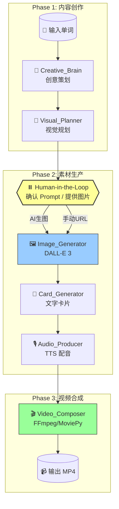

# Brain-Hole-Word (脑洞单词) Agent

🧠 一个基于 **LangGraph** 和 **LangChain 1.2.0** 的自动化短视频内容生产 Agent。

输入一个英语单词，自动生成适合抖音发布的 30 秒短视频素材（图片 + 卡片 + 音频 + 视频）。

## ✨ 核心特性

- **LangChain 1.2.0 新特性**：使用 `with_structured_output()` 进行结构化输出
- **Human-in-the-Loop**：在生图前暂停，支持用户确认或提供自定义图片
- **Ken Burns 效果**：静态图片通过推拉镜头产生动态感
- **全自动素材链**：创意 → 绘图 Prompt → 图片 → 卡片 → 音频 → 视频

## 🏗️ 架构设计

### 工作流图表



### 节点说明

| 节点 | 功能 | 技术实现 |
|:---|:---|:---|
| **Creative_Brain** | 查词、构思谐音/联想、编写脚本 | LLM + Structured Output |
| **Visual_Planner** | 将创意转化为绘图 Prompt | LLM + Structured Output |
| **Image_Generator** | 调用 AI 生图或下载用户图片 | DALL-E 3 / httpx |
| **Card_Generator** | 生成标题卡、例句卡、结尾卡 | Pillow + 中文字体 |
| **Audio_Producer** | 单词发音 + 解说配音 | Edge TTS (免费) |
| **Video_Composer** | 组装视频 + Ken Burns 动效 | MoviePy |

### 30秒视频结构

| 时间段 | 内容 | 素材来源 |
|:---|:---|:---|
| 0-3s | 单词标题卡 + 发音 | Card_Generator + Audio |
| 3-18s | 主图 + 脑洞解说 (Ken Burns 推拉) | Image_Generator + Audio |
| 18-25s | 例句展示 | Card_Generator |
| 25-30s | 结尾引导卡 | Card_Generator |

## 🛠️ 安装

### 1. 环境要求

- Python >= 3.10
- FFmpeg (系统级安装)

```bash
# macOS
brew install ffmpeg

# Ubuntu
sudo apt install ffmpeg
```

### 2. 安装依赖

```bash
pip install -r requirements.txt
```

### 3. 配置

编辑 `config.yaml`：

```yaml
llm:
  creative_model: "gpt-4o"  # 或 gpt-5, gemini-3-pro 等

image_generation:
  provider: "dall-e-3"
  quality: "hd"

audio:
  provider: "edge-tts"  # 免费方案
  voice_cn: "zh-CN-YunxiNeural"

workflow:
  human_in_the_loop: true  # 生图前暂停确认
```

### 4. 设置 API Key

```bash
export OPENAI_API_KEY="your-key-here"
```

## 🚀 运行

```bash
python main.py
```

交互示例：

```
请输入单词 (例如: Ambulance): Ambulance
请输入音标 (可选): /ˈæmbjələns/

📌 Phase 1: 创意与视觉规划
  ✅ [Creative_Brain] 完成
     策略: 谐音
     口号: 俺不能死！救护车来了！
  
  ✅ [Visual_Planner] 完成
     主场景 Prompt: A 3D Pixar style ambulance...

⏸️ Human-in-the-Loop: 请确认视觉方案
  [1] 使用 AI 自动生成图片
  [2] 我提供图片 URL
  [3] 取消任务
请输入选项: 1

📌 Phase 2: 素材生成与视频合成
  ✅ [Image_Generator] 完成
  ✅ [Card_Generator] 完成
  ✅ [Audio_Producer] 完成
  ✅ [Video_Composer] 完成

🎉 最终视频: ./output/video/Ambulance_final.mp4
```

## 📁 输出目录结构

```
output/
├── images/
│   └── Ambulance_main.png      # AI 生成的主图
├── cards/
│   ├── Ambulance_title.png     # 标题卡
│   ├── Ambulance_sentence.png  # 例句卡
│   └── Ambulance_ending.png    # 结尾卡
├── audio/
│   ├── Ambulance_pronunciation.mp3  # 单词发音
│   └── Ambulance_narration.mp3      # 解说配音
└── video/
    └── Ambulance_final.mp4     # 最终视频
```

## 📦 依赖列表

- `langchain>=1.2.0` - LLM 框架
- `langgraph>=0.2.0` - 工作流编排
- `langchain-openai` - OpenAI 集成
- `edge-tts` - 免费 TTS
- `Pillow` - 图片处理
- `moviepy` - 视频编辑
- `pydantic` - 数据验证

## 🎯 后续计划

- [ ] 支持 Midjourney API
- [ ] 批量处理多个单词
- [ ] 添加背景音乐混音
- [ ] 支持更多视频模板风格
